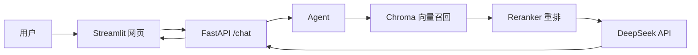

# 能源 RAG Agent

一个面向能源知识问答的 RAG 应用。项目使用本地知识库、Chroma 向量数据库、BGE Embedding、Reranker 和 DeepSeek API，为用户提供带检索证据的多轮对话问答。

## 功能

- 本地文本知识库检索
- Chroma 持久化向量数据库
- 中文 Embedding 语义检索
- Reranker 对候选资料重排
- DeepSeek Function Calling 工具调用
- FastAPI 后端接口
- Streamlit 聊天网页
- 多轮上下文对话
- 回答来源和检索证据展示
- pytest 自动化测试

## 架构



## 技术栈

- Python
- DeepSeek API
- OpenAI Python SDK
- FastAPI + Uvicorn
- Streamlit
- ChromaDB
- Sentence Transformers
- BGE 中文 Embedding 模型
- BGE Reranker
- pytest

## 项目结构

```text
minimal-agent/
├── app/
│   ├── api.py                  # FastAPI 接口
│   ├── web.py                  # Streamlit 网页
│   ├── deepseek_chat.py        # Agent 与工具调用逻辑
│   ├── build_vector_db.py      # 构建 Chroma 向量数据库
│   ├── chroma_retrieval.py     # 向量检索
│   ├── reranker.py             # Reranker 重排
│   └── reranked_retrieval.py   # 召回和重排流程
├── data/                       # 本地能源知识库文本
├── tests/                      # 自动化测试
├── requirements.txt
└── README.md
```

## 快速开始

### 1. 创建并激活虚拟环境

```powershell
python -m venv .venv
.\.venv\Scripts\Activate.ps1
```

### 2. 安装依赖

```powershell
python -m pip install -r requirements.txt
```

### 3. 配置 DeepSeek API Key

在项目根目录创建 `.env`：

```env
DEEPSEEK_API_KEY=你的_API_Key
```

`.env` 不应提交到 GitHub。

### 4. 构建本地向量数据库

```powershell
python -m app.build_vector_db
```

### 5. 启动 FastAPI 后端

打开一个终端：

```powershell
python -m uvicorn app.api:app --reload
```

接口文档：

```text
http://127.0.0.1:8000/docs
```

### 6. 启动 Streamlit 网页

再打开一个终端：

```powershell
python -m streamlit run app/web.py
```

网页地址通常为：

```text
http://localhost:8501
```

## 测试

```powershell
python -m pytest
```

## RAG 流程

1. 读取 `data/` 中的能源资料。
2. 将资料切分并转换为向量。
3. 将向量和元数据持久化到 Chroma。
4. 用户问题转换为向量，从 Chroma 召回候选文本。
5. 使用 Reranker 对候选文本重新排序。
6. Agent 将检索结果作为工具输出交给 DeepSeek。
7. 网页展示回答、来源文件和实际检索证据。

## 当前限制

- 聊天记录只保存在当前浏览器会话内，刷新页面或重启服务会丢失。
- 知识库当前以本地 `.txt` 文件为主。
- 首次启动会加载本地 Embedding 模型和 Reranker，响应较慢。
- 项目尚未 Docker 化部署。

## 后续计划

- 支持 PDF、Word 等文档上传与解析
- 使用 SQLite 持久化聊天记录
- 支持流式输出
- 使用 Docker Compose 一键部署
- 增加检索与生成效果评估集